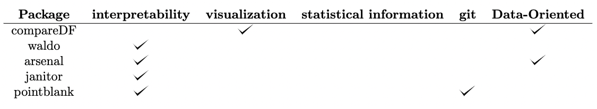
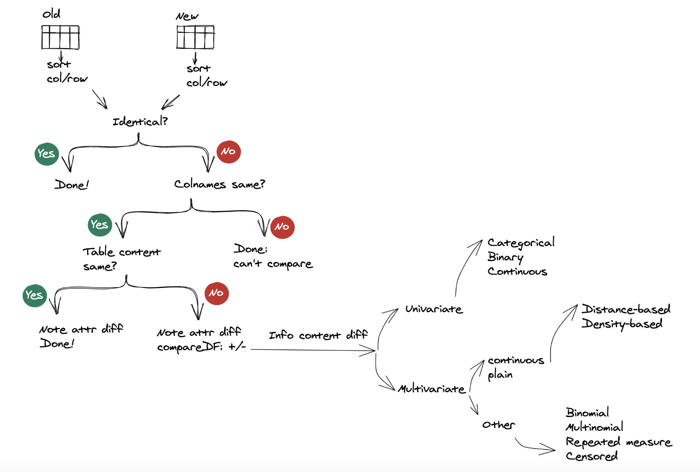

# ddiff
The big-data opportunity is compelling in complex business environments experiencing an explosion in the types and volumes of available data. In the health-care and pharmaceutical industries, data growth is generated from several sources, including the R&D process, retailers, patients, caregivers and etc. Effectively utilizing these data will help pharmaceutical companies better identify new potential drug candidates and develop them into effective, approved and reimbursed medicines more quickly. As a result, companies are hiring analytics teams to serve business units, and even as data became more crucial to decision-making and product roadmaps. However, the teams in charge of data pipelines were treated more like plumbers and less like partners. With better tooling, more diverse roles, and a clearer understanding of data’s full potential, most forward-thinking teams are adopting a new paradigm: data as a product(`DaaP`). In the DaaP model, company data is viewed as a product, and the data team’s role is to provide that data to the company in ways that facilitate good decision-making and application building. Some important characteristics of this model:

- Data has an SLA (figuratively) from the entire data team, not just data engineering
- Data flow is unidirectional, from the data team to the company
- Domain expertise has limited benefits for data team members

While each of these definitions has its own nuance, there are clearly some key takeaways: treating data as a product involves serving internal “customers” (data consumers), enabling decision-making and other key functions, and applying standards of rigor like SLAs. The key step is to apply a data as a product mindset is how you build, monitor, and measure data products. So when it comes to building pipelines and systems, use the same proven processes as you would with production software, like creating scope documents and breaking projects down into sprints. One of key sprints is the ability to track the difference of data product over time. In order to achieve this goal, we build a custom 'ddiff' function to tackle this problem. 

# Related work
Various packages have come along with utilities that could help characterize or 
compare tabular data. Examples include, 
[`compareDF`](https://github.com/alexsanjoseph/compareDF), 
[`waldo`](https://waldo.r-lib.org/index.html), 
[`arsenal`](https://cran.r-project.org/web/packages/arsenal/vignettes/comparedf.html), 
[`janitor`](http://sfirke.github.io/janitor/), and
[`pointblank`](https://rich-iannone.github.io/pointblank/index.html). Comparisons provided by these packages, while get us closer to something akin to
a utility that could help us interpret changes as `diff` does, they typically 
fall short.  For example, `compareDF`, as the package that most directly seeks 
to mimic a `git` type `diff` functionality, rather than aiming for what's the 
spirit of diff (i.e. enabling the developer to interpret differences) mimics 
text tracking functionality of `diff`, which as mentioned is not suitable for 
data.  As a concrete example, from information perspective, reordering of 
columns and rows does not change the information-content of a data table. 
However, both `git` and `compareDF` treat row re-arrangement as change by 
default (i.e. when you don't specify a grouping variable). Furthermore, all 
mentioned packages shy away from statistical information tracking. Authors, 
may have thought about and consciously decided to exclude that from the scope of
their projects, given complexities of general purpose tools for what could be 
akin to anomaly detection.  However, given the value of such approaches, even 
limited application of statistical approaches (e.g. finding univariate extreme 
values which is fairly robust), could move us closer to having tools that 
provide actionable `diff` like functionality for data. The illustration below shows a comparison to implementing a diff functionality with packages dicussed above. {width=100%}

# Approach
The are two lines of components in the ddiff function workflow. The first is Form or base content diff. The second is Information content diff. Form or base content diff is mechanical and quite straight forward to implement. In contrast, information content `diff` ventures in the realm of unsupervised learning and hence more complex.   
{width=100%}
